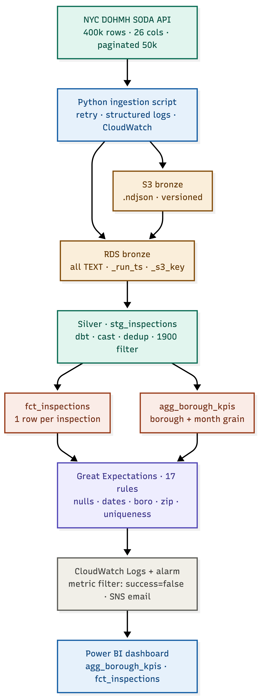
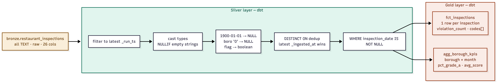
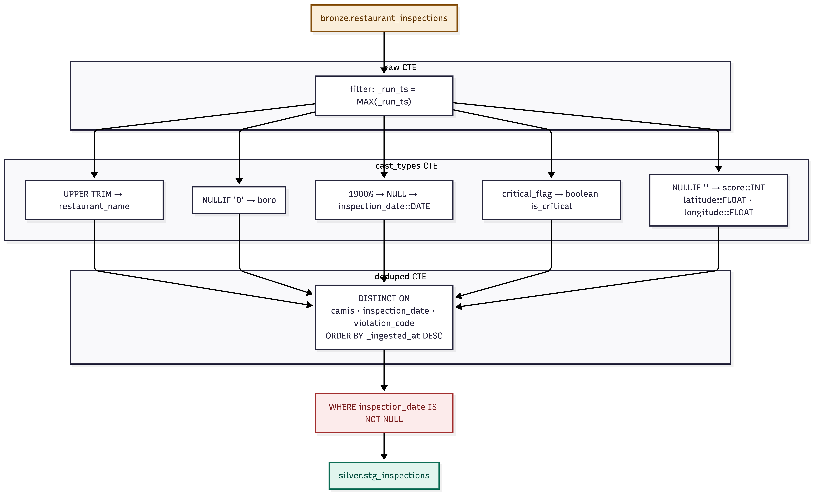
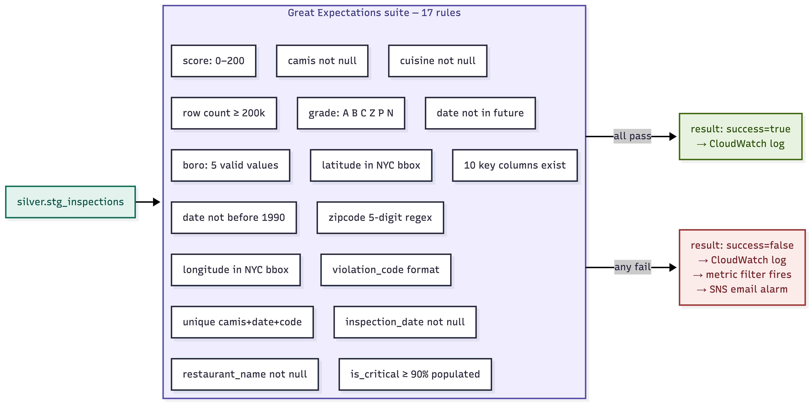

# NYC Restaurant Inspection ETL Pipeline

I built this to answer a straightforward question: which NYC boroughs have the worst restaurant inspection scores, and is that changing over time? The answer turns out to be more interesting than I expected — but getting there required wrangling 400k rows of messy city data, sentinel dates from 1900, and per-violation row duplication that'll bite you if you're not paying attention.

The pipeline pulls from the NYC DOHMH SODA API daily, lands raw JSON in S3, cleans and deduplicates it with dbt, runs 17 data quality checks, and surfaces compliance KPIs in Power BI.

---
## Live Dashboard

### 👉 [View the live dashboard here](https://public.tableau.com/views/NYCRestaurantInspectionanalysis_17792010976800/DashbNYCRestaurantInspectionIntelligenceC-SuiteOverviewoard1?:language=en-GB&:sid=&:redirect=auth&:display_count=n&:origin=viz_share_link)

## Architecture
---




---
## Stack

| Layer | Tech |
|---|---|
| Ingestion | Python 3.11, boto3, requests, psycopg2 |
| Storage | S3 (ndjson), RDS PostgreSQL 15 |
| Transform | dbt-postgres 1.7 |
| Quality | Great Expectations 0.18 |
| Monitoring | CloudWatch Logs, Alarms, SNS |
| IaC | CloudFormation |
| Dashboard | Power BI Desktop / Tableau + On-premises Gateway |
| CI/CD | GitHub Actions |

---

## Dataset

- **Source:** [NYC DOHMH Restaurant Inspection Results](https://data.cityofnewyork.us/Health/DOHMH-New-York-City-Restaurant-Inspection-Results/43nn-pn8j)
- **Endpoint:** `https://data.cityofnewyork.us/resource/43nn-pn8j.json`
- **Volume:** ~400,000 rows, 26 columns

Three things in this dataset will catch you off guard if you don't read the docs first. Rows are per-violation, not per-inspection — one visit can produce 10 rows, and score and grade repeat identically across all of them. Restaurants that applied for a permit but haven't been inspected yet show `inspection_date = 1900-01-01`; those get filtered out in the silver layer. And `score` and `grade` are both NULL on a restaurant's first inspection, which is normal — not missing data.

---

## Project structure

```
.
├── .env.example                  # copy to .env, fill in values, never commit .env
├── .gitignore
├── .gitleaks.toml                # blocks AWS keys and passwords on every push
├── cloudformation/
│   └── resources.yaml            # S3, RDS, Lambda role, CloudWatch log groups
├── ingest/
│   └── fetch_to_s3_postgres.py   # paginated fetch → S3 ndjson → RDS bronze
├── dbt_project/
│   ├── dbt_project.yml
│   ├── profiles.yml.example      # real profiles.yml is gitignored
│   └── models/
│       ├── silver/stg_inspections.sql
│       └── gold/
│           ├── fct_inspections.sql
│           └── agg_borough_kpis.sql
├── ge/
│   └── create_suite.py           # 17 GE expectations + CloudWatch publisher
├── reconciliation/
│   └── recon.sql                 # 7 sanity-check queries
├── cloudwatch/
│   └── setup_alarms.sh           # metric filters, SNS topic, alarms
├── docs/
│   └── data_dictionary.md
└── requirements.txt
```

---

## Quickstart

### 1. Clone and configure

```bash
git clone https://github.com/YOUR_ORG/nyc-inspection-pipeline.git
cd nyc-inspection-pipeline
cp .env.example .env
# fill in .env — this file is gitignored, it stays on your machine
```

### 2. Install dependencies

```bash
python3 -m venv venv && source venv/bin/activate
pip install -r requirements.txt
```

### 3. Deploy AWS infrastructure

```bash
aws cloudformation deploy \
  --template-file cloudformation/resources.yaml \
  --stack-name nyc-inspections \
  --parameter-overrides \
      DBPassword="YourStrongPassword!" \
      VpcId="vpc-xxxxxxxx" \
      SubnetIds="subnet-aaa,subnet-bbb" \
  --capabilities CAPABILITY_NAMED_IAM
```

### 4. Run the pipeline

```bash
# Ingest (~20 mins for 400k rows)
python ingest/fetch_to_s3_postgres.py

# Transform
cd dbt_project && dbt run && dbt test

# Validate
python ge/create_suite.py

# Alarms — run once
ALARM_EMAIL=you@email.com bash cloudwatch/setup_alarms.sh
```

### 5. GitHub Actions

Add these in **Settings → Secrets and variables → Actions**:

| Secret | Description |
|---|---|
| `AWS_ACCESS_KEY_ID` | IAM user key — swap for an OIDC role in prod |
| `AWS_SECRET_ACCESS_KEY` | IAM user secret |
| `SODA_APP_TOKEN` | Free from data.cityofnewyork.us |
| `S3_BRONZE_BUCKET` | e.g. `nyc-inspections-bronze-123456789` |
| `DB_HOST` | RDS endpoint |
| `DB_NAME` | `inspections` |
| `DB_USER` | `pipeline_admin` |
| `DB_PASSWORD` | Pull from Secrets Manager in prod, not here |

Runs daily at 06:00 UTC. Trigger manually via **Actions → Run workflow**.

### 6. Tableau dashboard

For the compliance KPI dashboard, I used Tableau Public instead of Power BI.

The original plan was Power BI, but Power BI requires a Pro or Premium license 
to publish and share dashboards — there is no free hosting option for external 
viewers. Tableau Public solves this completely: you can connect to a live data 
source, build the full dashboard, publish it to Tableau Public, and share a 
link that anyone can view in a browser without an account or license.

The dashboard connects directly to the gold schema on RDS PostgreSQL, pulling 
from two tables:

- `gold.agg_borough_kpis` — monthly compliance KPIs per borough (grade A rate, 
  average score, critical violations)
- `gold.fct_inspections` — inspection-level detail for drill-down views

### Connecting Tableau to RDS

1. Open Tableau Desktop (free trial) or Tableau Public Desktop (free)
2. Connect → PostgreSQL
3. Server: your RDS endpoint
4. Port: 5432
5. Database: inspections
6. Username / Password: use the `powerbi_reader` role created earlier
7. Select `gold` schema → drag in `agg_borough_kpis` and `fct_inspections`

###  Power BI

Install the PostgreSQL ODBC driver, then: Power BI Desktop → **Get Data → PostgreSQL** → your RDS endpoint on port 5432. Load `gold.agg_borough_kpis` in Import mode and `gold.fct_inspections` in DirectQuery. If your RDS is in a private subnet (it should be), you'll need the Power BI On-premises Data Gateway running on an EC2 in the same subnet.

### Publishing

1. File → Save to Tableau Public
2. Sign in with your free Tableau Public account
3. Dashboard is now live at a public URL — share it with anyone

### Key views in the dashboard

- Borough compliance map — grade A rate per borough, colour-coded
- Monthly trend lines — average inspection score over time per borough  
- Critical violations breakdown — total critical violations by borough and month
- Drill-down — click any borough to filter to individual restaurant inspections
---

## Credentials

No credentials live in this repo. `.env` is gitignored. `profiles.yml` is gitignored. `.gitleaks.toml` runs on every push and PR and will block the push if it finds an AWS key, a Postgres connection string with a real password, or a generic `password=` assignment. The only credential-adjacent file that gets committed is `.env.example`, and every value in it is a placeholder.

For production: replace the IAM user key in CI with an OIDC role (GitHub's OIDC provider issues short-lived tokens per workflow run — no static key to rotate or leak), and pull the RDS password from AWS Secrets Manager at runtime rather than injecting it as an environment variable.

---

## Data quality

17 Great Expectations rules run after every dbt transform: row count ≥ 200k, column existence for all 10 key fields, `camis` not null, `inspection_date` not null and not in the future and not before 1990, `boro` restricted to the five borough names, `grade` restricted to A/B/C/Z/P/N, `score` between 0 and 200, `is_critical` populated on at least 90% of rows, unique `(camis, inspection_date, violation_code)` triplets, 5-digit zipcode format, `cuisine` and `restaurant_name` not null, `violation_code` matching the expected format, and lat/lon within the NYC bounding box.

Results go to `/nyc-inspections/great-expectations` in CloudWatch Logs as structured JSON. A metric filter on `success: false` triggers an SNS email within 5 minutes.

---

